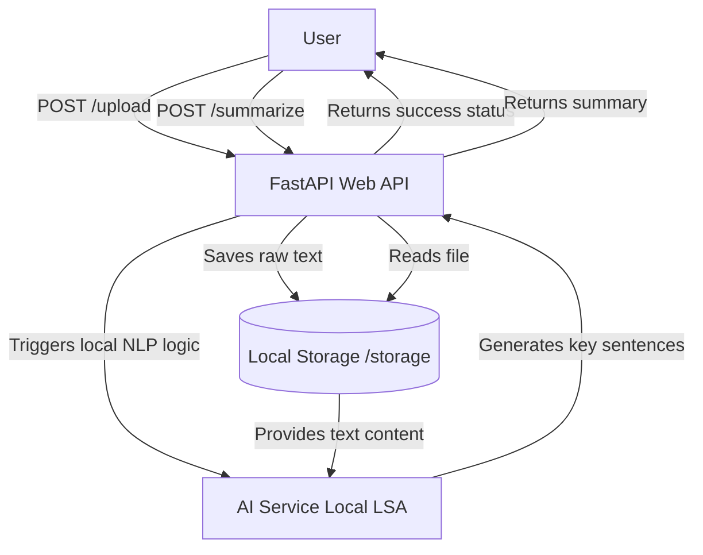

# AI Document Summarizer API

An asynchronous microservice application built with Python to handle fast document uploads and automated text summarization using local NLP algorithms.

## 🛠️ Tech Stack
* **FastAPI** — High-performance asynchronous Web API for uploading text records.
* **Aiofiles & Python-Multipart** — Non-blocking I/O integration for seamless file upload streaming.
* **Sumy (LSA Engine)** — Local Latent Semantic Analysis mathematical model for extractive text summarization.
* **NLTK & NumPy** — Specialized linguistic and matrix computation libraries for sentence tokenization and analytical data parsing.

## 📐 Architecture & Shared Volumes Overview



## 📂 Project Structure

```text
doc_summarizer/
├── storage/               # Local directory for binary file uploads
├── venv/                  # Isolated python virtual environment
├── ai_service.py          # Core NLP architecture and LSA layout logic
├── main.py                # FastAPI routes, schemas and lifestyle triggers
└── requirements.txt       # Frozen environment production packages
```

## 🚀 Getting Started

### Prerequisites
Ensure **Python 3.10** or higher is running on your machine.

### Installation & Launch

1. Navigate to the project folder:
   ```bash
   cd doc_summarizer
   ```

2. Create and activate an isolated python environment:
   ```bash
   py -m venv venv
   .\venv\Scripts\Activate.ps1
   ```

3. Configure active execution policies and install frozen packages:
   ```bash
   Set-ExecutionPolicy -ExecutionPolicy RemoteSigned -Scope Process
   pip install -r requirements.txt
   ```

4. Spin up the local development web server:
   ```bash
   uvicorn main:app --reload
   ```

Once deployed, the systems will be available at:
* 🌐 **Interactive Web Documentation (Swagger UI)**: http://localhost:8000/docs

## 🧪 API Specifications

* **`POST /upload`** — Validates incoming document attachments (.txt), pipes them directly into the secure local storage sector, and prepares them for further extraction.
* **`POST /summarize`** — Performs structural scans against the requested local text asset, runs mathematical sentence matrices, and renders the generated abstract summary metadata.
